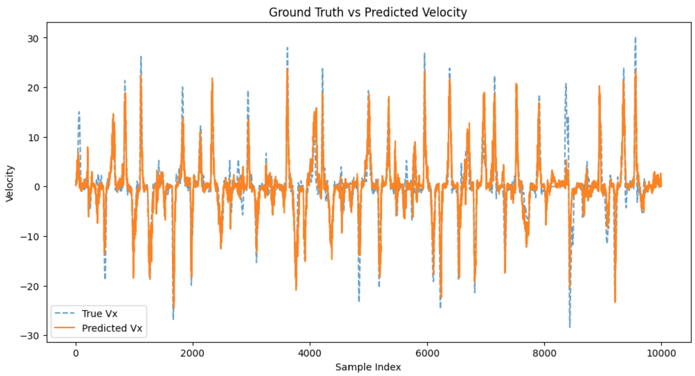
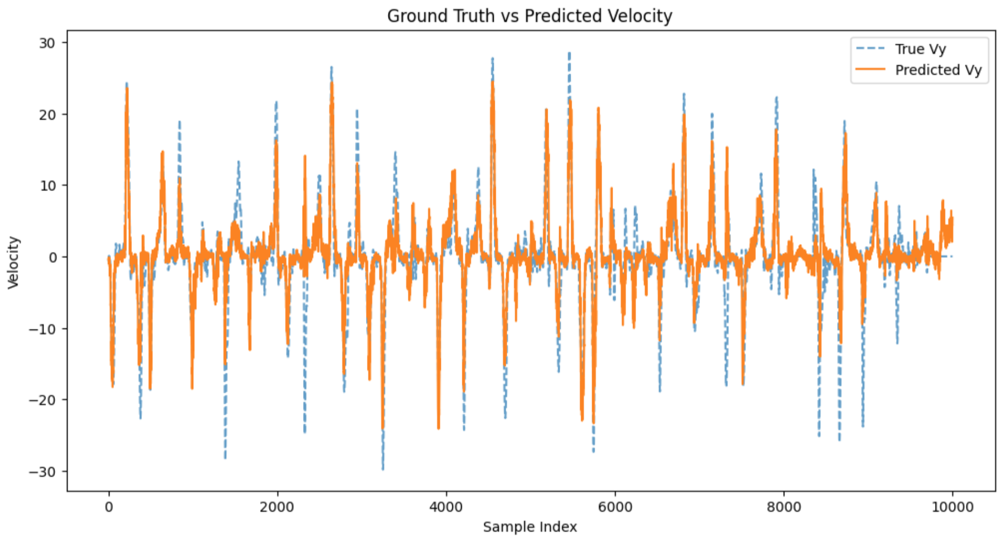

# Neural Spike-Based Cursor Velocity Prediction with Decoder-Only Transformers

## Overview
This project implements a Transformer-based model to predict the cursor velocity of a monkey based on its neural spike activity of Long-term recordings of motor and premotor cortical spiking activity during reaching in monkeys. The dataset consists of a session neural recordings from 71 channels sampled at ~100 Hz, with corresponding cursor velocity data. The goal is to model the relationship between neural activity and movement dynamics using a **decoder-only Transformer**, implemented from scratch.


## Project Structure

- `data_loader.py` - Loads neural data from a remote source.
- `preprocessing.py` - Processes spike times and aligns them with indices.
- `model.py` - Defines the neural network architecture.
- `train.py` - Trains the neural decoder model and evaluates performance.
- `utils.py` - Contains helper functions for data normalization and conversion.

## Installation

```sh
pip install -r requirements.txt
```

## Usage

1. **Load Data**
   ```sh
   python data_loader.py
   ```
2. **Preprocess Data**
   ```sh
   python preprocessing.py
   ```
3. **Train Model**
   ```sh
   python train.py
   ```

## Requirements
See `requirements.txt` for dependencies.

---

## Dataset
- **Neural Data:**
  - `spike_times`: (n_samples,)
  - `spike_times_index`: (n_channels,)
  
- **Cursor Velocity Data:**
  - `timestamps`: (time,)
  - `data`: (time, Velocity_channels) → `[Vx, Vy]`

## Preprocessing Pipeline
1. **Binning Neural Data:**
   - Spikes are binned into 100ms windows, each containing 10 bins of 10ms.
   
2. **Removing Abnormal Velocities:**
   - Data points where \(|Vx| > 40\) or \(|Vy| > 40\) are filtered out.
   
3. **Tokenization and Temporal Embedding:**
   - Neural spikes are tokenized into numerical sequences.
   - Temporal embeddings are applied before passing data into the Transformer.

## Model Architecture
The model is a **decoder-only Transformer**, implemented from scratch. It consists of:
- **Multi-Head Self-Attention** (with learnable heads)
- **Feedforward Expansion Layer** (scales feature dimensions)
- **Positional Encoding**
- **Stacked Transformer Blocks**


### Test Results 
```
Test MSE: 13.135366, R2 Score: 0.689168
```




## Challenges and Next Steps
🔴 **Current Issue:** Multi-Session Training and Testing
✅ **Possible Improvements:**


## Contributors
- **Matin M.Babaei** – Intern
- **Arshia Afzal** – Supervisor

## License
EPFL License 


